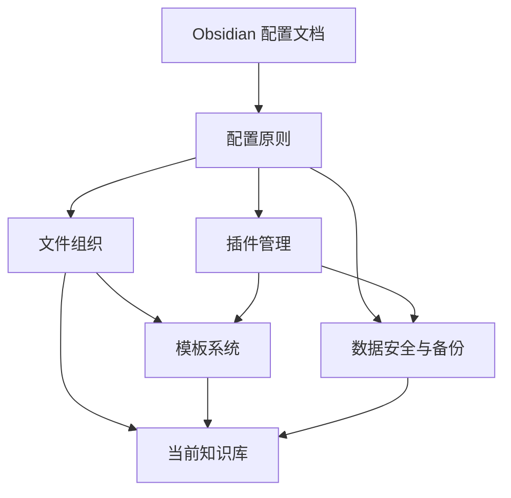

# Obsidian 配置知识图谱

> 本页是 Obsidian 配置主题的关系中心。下列 Wiki-links 会自动形成全局关系图谱中的节点和连线。

## 中心资料

- [[30-资源/Obsidian/Obsidian 详细配置文档（全场景落地版）- 分解与校正|配置文档分解与校正]]

## 核心概念

- [[30-资源/Obsidian/Obsidian 配置原则|配置原则]]
- [[30-资源/Obsidian/Obsidian 文件组织|文件组织]]
- [[30-资源/Obsidian/Obsidian 插件管理|插件管理]]
- [[30-资源/Obsidian/Obsidian 模板系统|模板系统]]
- [[30-资源/Obsidian/Obsidian 数据安全与备份|数据安全与备份]]

## 与当前知识库的连接

- [[知识库主页]]
- [[知识库使用指南]]
- [[30-资源/资源索引|资源索引]]
- [[90-模板/模板索引|模板索引]]

## 关系结构

返回：[[30-资源/资源索引|资源索引]]
