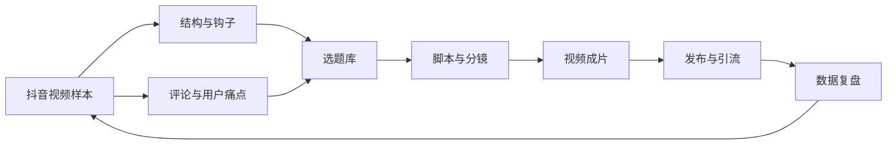

# 抖音 Codex 内容研究图谱

> 所有从抖音样本中学到的内容统一进入本图谱，不零散堆放。

## 研究链路

- 研究结论：[[30-资源/抖音运营/抖音 Codex 安装与接入内容研究报告 2026-08-08|抖音 Codex 安装与接入内容研究报告 2026-08-08]]
- 剪辑方法：[[30-资源/抖音运营/抖音 Codex 视频剪辑方法研究 2026-08-08|抖音 Codex 视频剪辑方法研究 2026-08-08]]
- 样本输入：[[30-资源/抖音运营/竞品视频样本库|竞品视频样本库]]
- 用户语言：[[30-资源/抖音运营/用户需求与评论洞察|用户需求与评论洞察]]
- 开场方法：[[30-资源/抖音运营/高转化钩子库|高转化钩子库]]
- 内容决策：[[30-资源/抖音运营/Codex 短视频选题库|Codex 短视频选题库]]
- 制作执行：[[30-资源/抖音运营/Codex 短视频脚本与分镜|Codex 短视频脚本与分镜]]
- 商业闭环：[[30-资源/抖音运营/抖音引流转化路径|抖音引流转化路径]]
- 项目管理：[[10-项目/Codex 抖音短视频引流项目|Codex 抖音短视频引流项目]]

## 现有基础素材

- [[30-资源/视频拆解/Codex Plus 接入 DeepSeek 完整安装教程|Codex Plus 接入 DeepSeek 视频拆解]]（对应外部[[30-资源/抖音运营/样本/S07 阿悦很严格 Codex Plus接入教程|参考样本 S07]]）
- [[30-资源/Obsidian/Obsidian 配置知识图谱|Obsidian 配置知识图谱]]

## 第一轮结论

- 50 条去重样本、10 条深度拆解已经入库。
- 高表现教程普遍具有“结果明确、步骤完整、可回看”的收藏价值。
- 赛道主要拥挤在“保姆级安装”，内容缺口集中在失败排查、工具能力是否保留和真实费用。
- 推荐主线：**先展示 Computer Use 成功证据，再讲三步配置，最后公开成本与限制。**

## 深度样本节点

- [[30-资源/抖音运营/样本/S01 阿川同学 Codex保姆级教程|S01 长教程标杆]]
- [[30-资源/抖音运营/样本/S02 林粒粒 Codex安装与国产模型|S02 小白速通]]
- [[30-资源/抖音运营/样本/S03 Ai林爻 普通人也能用Codex|S03 双系统实测]]
- [[30-资源/抖音运营/样本/S04 拓肯2035 一分钟安装Codex|S04 一分钟安装]]
- [[30-资源/抖音运营/样本/S05 阿威 Codex隐藏能力实战|S05 安装后实战]]
- [[30-资源/抖音运营/样本/S06 阿然Vision Codex接入DeepSeek|S06 工具链保留]]
- [[30-资源/抖音运营/样本/S07 阿悦很严格 Codex Plus接入教程|S07 逐字稿对应样本]]
- [[30-资源/抖音运营/样本/S08 小白跃升坊 DeepSeek V4 Flash实测|S08 低表现对照]]
- [[30-资源/抖音运营/样本/S09 峰哥AI视界 Codex接入DeepSeek|S09 多工具路径]]
- [[30-资源/抖音运营/样本/S10 蒙古大叔 普通人用不起Codex|S10 成本争议]]

## 关系结构

返回：[[30-资源/资源索引|资源索引]]
